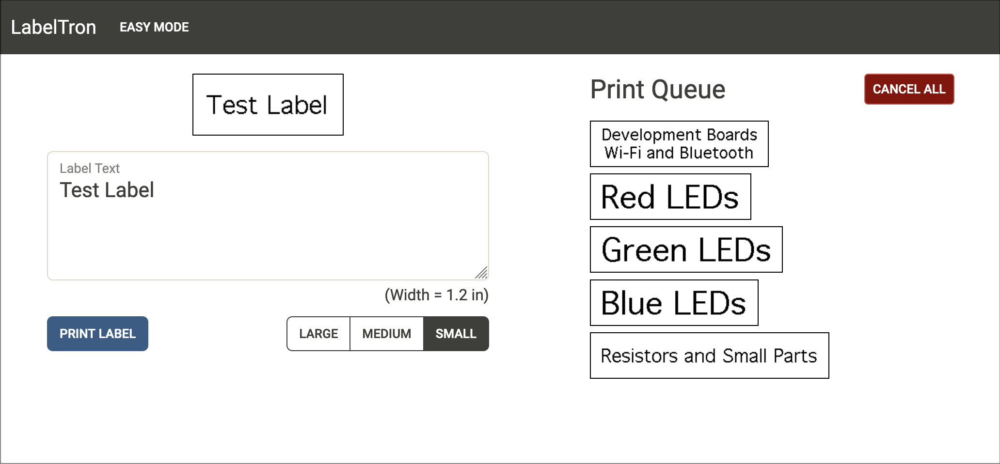

# LabelTron

Remote web interface for [Brother PT-P750W](https://www.amazon.com/gp/product/B00JHME7W4) label printers.

- Supports several prints with one text input
- Supports multi-line prints
- For shared environments:
    - HTTP authentication
    - Require physical button press to print

## References

- [http://www.odorik.cz/w/ptouch](http://www.odorik.cz/w/ptouch)
- [https://git.familie-radermacher.ch/linux/ptouch-print.git/](https://git.familie-radermacher.ch/linux/ptouch-print.git/)
